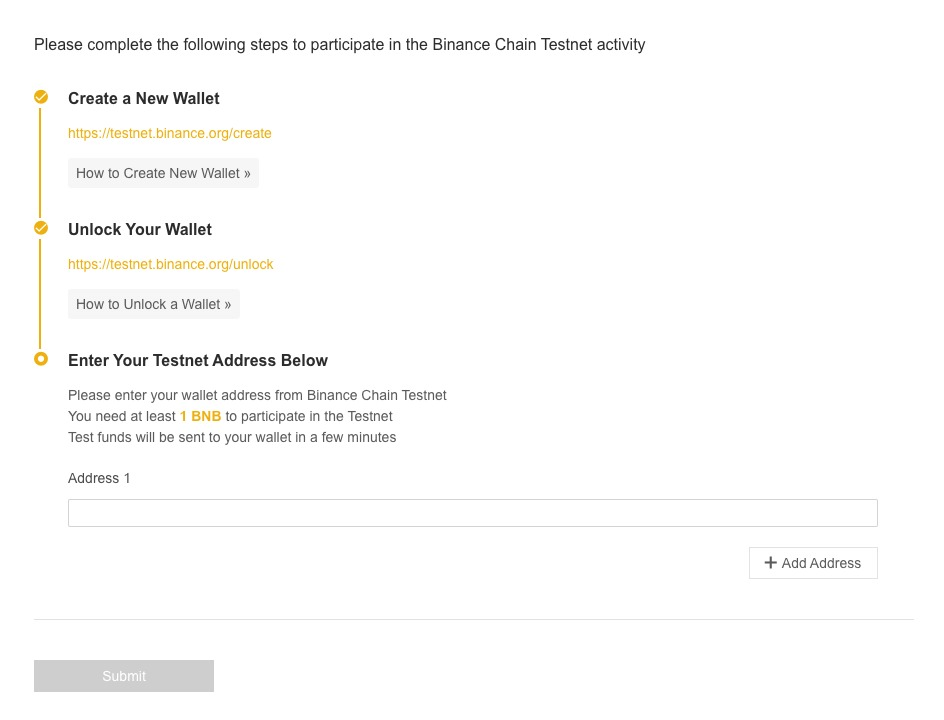

# Testnet

The testnet is a test environment for Binance Chain network, run by the Binance Chain development community, which is open to developers.

The validators on the testnet are from development team.

You can connect a node to the testnet by downloading the [node binary](https://github.com/binance-chain/node-binary/tree/master/fullnode/testnet/0.6.3-hotfix) to use this [configuration](https://github.com/binance-chain/node-binary/tree/master/fullnode/testnet/0.6.3-hotfix/config).

There is also a [web wallet](https://testnet.binance.org/en/) that can directly interact with the DEX. testnet.

## What is the testnet good for?

- Create your test address and get your testnet funds.
- Develop applications and try tutorials on Binance Chain without the potential to lose your own assets.
- Test your applications against new versions of Binance Chain.
- Analyze blockchain data on a smaller, non-trivial data set compared to the public network.

# How to get Testnet Fund

> Note: To obtain Binance Chain testnet funds, you must have a Binance account that has a minimum of 1 BNB in it. The 1 BNB will remain in your account and can be withdrawn or traded after requesting testnet BNB for the Binance Chain. The 1 BNB requirement is merely an anti-spam measure.

1. Navigate to the [testnet faucet](https://www.binance.com/en/dex/testnet/address) and log in to your Binance.com account.

2. Create an address on testnet by following [this guide](create-address.md)

3. Enter your testnet address in the form

When complete, you will receive 200 testnet BNB so that you can interact with the Binance DEX testnet.

Once there, enter your testnet address and click on the “+ Add Address” button, you can then add another address if you wish to send testnet funds to multiple testnet accounts.

When you have finished adding your testnet addresses, press “Submit”.

The testnet funds will be sent shortly afterward. In order to see them, navigate to the Binance Chain Explorer and search for your testnet address, and you will be able to see them in your recent transactions on the Binance Chain. You can then use these funds on the Binance DEX.
