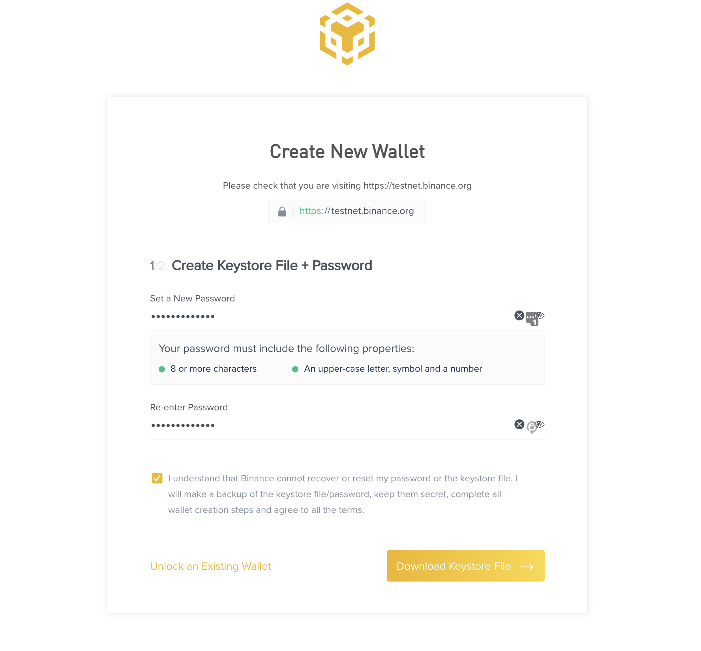
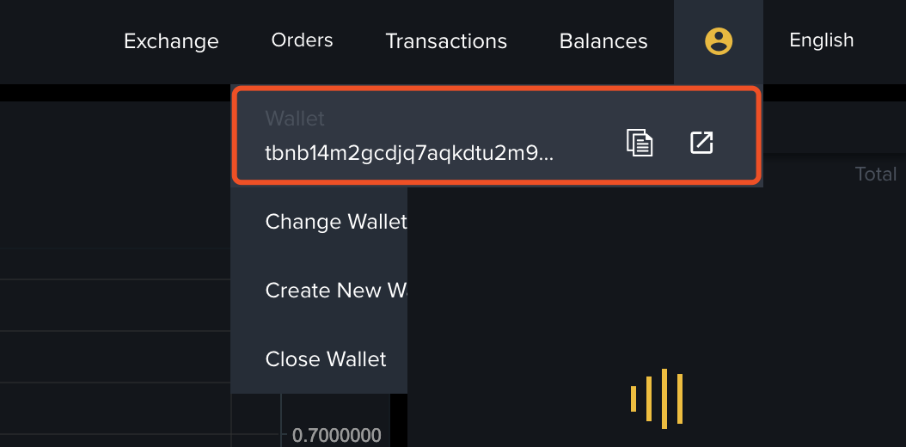

# List Instruction

Listing a trading pair is a rather advanced procedure in DEX. To list your token, you can follow the step-by-step 
instruction here.

## Create a key

First of all, you need to have a key to do all these steps. There are two ways to create a key: creating a key in 
web wallet and creating a key via `bnbcli`.

Now you can only issue and list your token via Command Line Interface, i.e. `bnbcli`. You can check the below instruction 
to create a new key or load your key created from Web Wallet or other Wallet into your CLI key store. Please make 
sure you backup your mnemonic.

### Web Wallet

1. You can create a key via [web wallet](https://testnet.binance.org/create)

Follow the instructions and set your password here(password is used to unlock the keystore file you will get here):



Then click `Download Keystore File` and you will get a keystore file and be directed mnemonic page. Pls back up 
mnemonic here and it will be used to restore your key.


2. You can restore you key [here](https://testnet.binance.org/unlock)

Choose `Mnenomic Phrase`, paste the mnemonic you get above and set you session password:


Your wallet will be unlocked and you can get you address(for this example is `tbnb14m2gcdjq7aqkdtu2m9qrqrl8eevzpqfj9xc0uu`) here:




### Bnbcli

You can get `bnbcli` by following instructions [here](./api-reference/cli.md).

You should get mnemonic if you follow the instructions above. You can restore you key via `bnbcli` or create a new key.

1. Restore your key

```bash
$ ./bnbcli keys add test --recover
Enter a passphrase for your key:
Repeat the passphrase:
> Enter your recovery seed phrase:
more advice achieve mass clap nose bike bird busy section rigid model doll exchange guard theme catalog junior patrol valley depart decade convince master
NAME:	TYPE:	ADDRESS:						PUBKEY:
test	local	tbnb14m2gcdjq7aqkdtu2m9qrqrl8eevzpqfj9xc0uu	bnbp1addwnpepqt7nf2dwgfxv6kmzgwhzlp556yhdfeakfdejc6lp8xcddsv83kq552m63s9
```

2. Create a new key

You can also create a new key and you will get a new mnemonic.
```bash
$ ./bnbcli keys add new_key
Enter a passphrase for your key:
Repeat the passphrase:
NAME:	TYPE:	ADDRESS:						PUBKEY:
new_key	local	tbnb1c5dxrdn9xuw0njwcyevzyjrza550z5au8v0hyz	bnbp1addwnpepqwdsud63f5rq2wkgrezlvzdauf4x7wp3defzvhrzkwdzl7p0n6uk666ghpa
**Important** write this seed phrase in a safe place.
It is the only way to recover your account if you ever forget your password.

napkin degree boring custom differ smart bundle ball length lyrics auto forest jeans awake entry vocal there repeat rule churn picnic promote screen skull
```

## Get test BNB 

You can get test BNB [here](https://www.binance.com/login.html?callback=/en/dex/testnet/address). 

Each address will get 200 BNB from the above testnet faucet. You can get more from your friends or register more addresses 
and centralize all BNB to one address via Transfer. You need certain amount of BNB to issue and list your token, p
lease check fees at [fee table](./trading-spec.md).

You can refer to [doc](./transfer.md) for how to transfer tokens.

## Issue token

Assume that you have enough BNB, you can issue you token now. 400BNB of fee will be charged.

```bash
# To issue a AAA token with total-supply 1 billion
# please note all the numbers have 8 trailing digits (usually zero) for decimal part

> ./bnbcli token issue --token-name "AAA token" --total-supply 100000000000000000 --symbol AAA --mintable --from alice --chain-id=Binance-Chain-Nile --node=data-seed-pre-2-s1.binance.org:80 --trust-node

Committed at block 1887 (tx hash: B90A055DDD570AE42A7050182993A0B4DBC81A0D, ... Issued AAA-254...)
```

Then you will get you token and it's `AAA-254`. 

For details about issuing token, you can refer to [here](./tokens.md).

## Create proposal to list your token

What you need to do now is to create a proposal. 

A proposal is a step to notify the validators your request of listing and allow them to vote. You can only run list
command with success after the proposal is voted as "pass".

Please note:

+ `--init-price` must be 100000000, i.e. 1 BNB for Trading Competition. otherwise your proposal will be rejected.
+ `--from test`: test is your local name for the address / key, you can only list with the owner address of your token.
+ `--expire-time 1553126400`: expire time is after when you will not be able to list your token though your proposal is passed. 
here is `2019/03/21`, two weeks from now.

Fee(10 BNB) will be charged for each proposal.

```bash
$  ./bnbcli gov submit-list-proposal --from test --deposit 10000000000:BNB \
--base-asset-symbol AAA-254 --quote-asset-symbol BNB --init-price 100000000 --title "list AAA-254/BNB" \
--description "list AAA-254/BNB" --expire-time 1553126400 --chain-id=Binance-Chain-Nile --node=data-seed-pre-2-s1.binance.org:80 --json
Password to sign with 'test':
{  
   "Height":"281822",
   "TxHash":"55966E369E567DF55B061E129EAA40EA09B5AA2F",
   "Response":{  
      "data":"Hg==",
      "log":"Msg 0: ",
      "tags":[  
         {  
            "key":"YWN0aW9u",
            "value":"c3VibWl0LXByb3Bvc2Fs"
         },
         {  
            "key":"cHJvcG9zZXI=",
            "value":"Ym5jMTdrd3pudWxqc3k0bjg5d2NqZDZlc3gyajV0MHczMjZjMDN4aHly"
         },
         {  
            "key":"cHJvcG9zYWwtaWQ=",
            "value":"Hg=="
         },
         {  
            "key":"YWN0aW9u",
            "value":"c3VibWl0X3Byb3Bvc2Fs"
         }
      ]
   }
}
```

You need to specify the base asset you want to list, quote asset and init price. And when the proposal is 
passed, you should use the identical params to list. 

And you also have to set expire time after which you will not be able to list even though proposal is passed.

Of course, the coins you deposit will be returned to your account once the proposal is passed. But if the proposal 
is rejected by the community, the coins will be distributed to validators. So please talk about the proposal in the 
online forum community before creating it and make sure there is an agreement on your listing proposal, because any 
new list would affect the whole network efficiency. 

You may notice that the numbers like deposit number and price are very large. The numbers are presented as integers 
in the chain data structure and codebase. The last 8 digits of the integer represent the fractional-part 
(digits after the decimal point) by default if the number is presented in a real decimal number. For example, 
10000000000 means 100.00000000 if represented as a human readable number.

## Find your proposal ID

Each proposal is assigned a unique ID, but this is not included in the transaction that you send yourself. 
You must query for the list of proposals to find the one that you have sent to the blockchain:

```bash
$  ./bnbcli gov query-proposals --chain-id=Binance-Chain-Nile --node=data-seed-pre-2-s1.binance.org:80
  1 - list BNB/BTC.B-9CE
  2 - list XRP.B-2A4/BNB
  ...
  14 - list AAA-254/BNB
```

In this case, `14` is your proposal ID, and you should then use it in the `--proposal-id` parameter in the next steps.


### The deposit

Before validators can vote on the proposal you created, you need to deposit enough BNB (at least 2000 BNB). You 
may have already deposit a number of BNB when you propose, in the upper case, it is 100 BNB. So now you still 
need to deposit another 1900 BNB.

```bash
$  ./bnbcli gov deposit --deposit 190000000000:BNB --from test --proposal-id 14 
--chain-id=Binance-Chain-Nile --node=data-seed-pre-2-s1.binance.org:80 --json
Password to sign with 'test':
{  
   "Height":"282059",
   "TxHash":"78EE857C19E44294387CEE28C9CB71895EB0B670",
   "Response":{  
      "log":"Msg 0: ",
      "tags":[  
         {  
            "key":"YWN0aW9u",
            "value":"ZGVwb3NpdA=="
         },
         {  
            "key":"ZGVwb3NpdGVy",
            "value":"Ym5jMTdrd3pudWxqc3k0bjg5d2NqZDZlc3gyajV0MHczMjZjMDN4aHly"
         },
         {  
            "key":"cHJvcG9zYWwtaWQ=",
            "value":"Hg=="
         },
         {  
            "key":"YWN0aW9u",
            "value":"ZGVwb3NpdA=="
         }
      ]
   }
}
```

### Wait for voting result

When you have deposited enough BNB, the proposal's status will switch to `VotingPeriod`. Then you should wait
for voting result from validators (for now is 4 hours in the testnet).

If proposal is rejected by validator, the money you have deposited will be distribute to validators. If you think it is 
mistake, please talk on the [community](https://community.binance.org/).

If proposal is passed, BNB you have deposited will be returned.

You can query proposal status via CLI.

```bash
$  ./bnbcli gov query-proposal --proposal-id 15 --chain-id=Binance-Chain-Nile --node=data-seed-pre-2-s1.binance.org:80
{
  "type": "gov/TextProposal",
  "value": {
    "proposal_id": "15",
    "title": "list AAA-254/BNB",
    "description": "{\"base_asset_symbol\":\"AAA-254\",\"quote_asset_symbol\":\"BNB\",\"init_price\":100000000,\"description\":\"list AAA-254/BNB\",\"expire_time\":\"2019-03-21T00:00:00Z\"}",
    "proposal_type": "ListTradingPair",
    "proposal_status": "Passed",
    "tally_result": {
      "yes": "100000000000",
      "abstain": "0",
      "no": "0",
      "no_with_veto": "0"
    },
    "submit_time": "2018-12-25T09:17:56.128860238Z",
    "total_deposit": [
      {
        "denom": "BNB",
        "amount": "200000000000"
      }
    ],
    "voting_start_time": "2018-12-25T09:21:14.282127201Z"
  }
}
```

### When the proposal passes

When proposal is passed, the owner of the token to be listed can list the token before `expire_time` specified. 800BNB 
of fee will be charged.

If you forget the symbol name of the token you issued, you can query your account info for detail.
```bash
$  ./bnbcli account bnc1wwgakqy32m7vdnlf00pctf9hnaak37eh7wkmqa --trust-node --node=data-seed-pre-2-s1.binance.org:80
{  
   "type":"bnbchain/Account",
   "value":{  
      "base":{  
         "address":"bnc1wwgakqy32m7vdnlf00pctf9hnaak37eh7wkmqa",
         "coins":[  
            {  
               "denom":"AAA-254",
               "amount":"19500000000000000"
            }
         ],
         "public_key":{  
            "type":"tendermint/PubKeySecp256k1",
            "value":"A1V88I61gCbF2V1RqdCxb0UN/8g95mNUlJGH5htNNC70"
         },
         "account_number":"0",
         "sequence":"337"
      },
      "name":"node0",
      "frozen":null,
      "locked":null
   }
}
```

Then you can list your asset according to the proposal, you need to make sure that arguments are identical to your 
proposal.

```bash
$  ./bnbcli dex list -s AAA-254 --quote-asset-symbol BNB --from test \
--init-price 100000000 --proposal-id 15 --chain-id=Binance-Chain-Nile --node=data-seed-pre-2-s1.binance.org:80 --json
{  
   "Height":"282409",
   "TxHash":"77AE3D190F430FE6E4B1A9659BEBB3F022CF7631",
   "Response":{  
      "log":"Msg 0: ",
      "tags":[  
         {  
            "key":"YWN0aW9u",
            "value":"ZGV4TGlzdA=="
         }
      ]
   }
}
```

Congratulations, your token should be listed now!